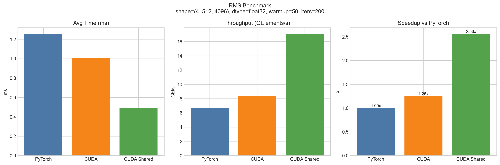
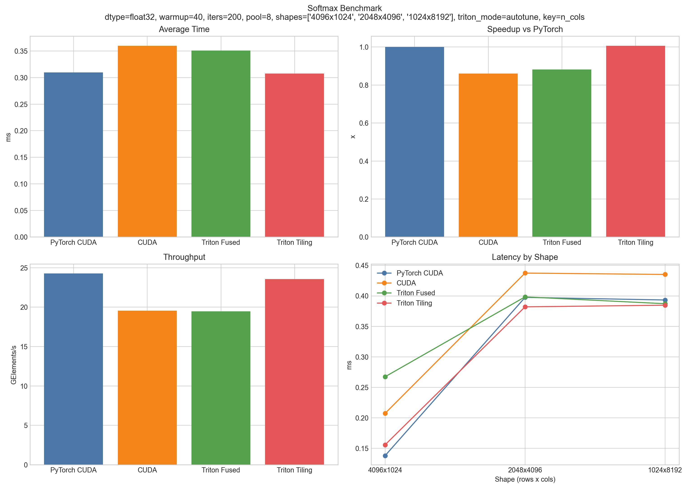

# Operator Learning: Softmax & RMSNorm 算子优化学习记录

这是我在学习大模型算子优化过程中的实践仓库，主要围绕两类常见算子展开：

- `Softmax`：手写 CUDA + Triton（Fused / Tiling）实现与对比
- `RMSNorm`：从基础 CUDA 到 Shared Memory 优化版本

目标是用可复现的代码和基准数据，记录从“能跑”到“跑得更快”的全过程。

## 目录结构

```text
operator_learning/
├─ softmax/        # Softmax CUDA/Triton实现、benchmark脚本和结果
├─ rms_norm/       # RMSNorm CUDA实现、benchmark脚本和结果
├─ figure/         # 汇总图与可视化结果
├─ 学习进度/        # 阶段性学习笔记与汇报
└─ README.md
```

## 环境说明

- OS：Windows（当前仓库基于 `.dll` 动态库调用）
- GPU：NVIDIA CUDA 设备（当前结果来自 RTX 4060 Laptop）
- Python：建议 3.10+
- 主要依赖：
  - `torch`（CUDA 版本）
  - `triton`（Softmax Triton 路径）
  - `matplotlib`（可视化，可选）

安装示例：

```bash
pip install torch triton matplotlib
```

## 快速开始

### 1) 运行 RMSNorm 基准

```bash
cd rms_norm
python use_rms_norm.py
```

输出文件（自动生成或更新）：

- `rms_benchmark_summary.csv`
- `rms_benchmark_summary_latest.csv`
- `benchmark_results.txt`
- `rms_benchmark_summary.png`（或在 `figure/` 中查看汇总图）

### 2) 运行 Softmax 基准

```bash
cd softmax
python benchmark_softmax.py
# 或
python test_softmax.py
```

输出文件（自动生成或更新）：

- `softmax_benchmark_summary.csv`
- `softmax_benchmark_summary_latest.csv`
- `softmax_benchmark_detail.csv`
- `softmax_benchmark_report.txt`
- `softmax_benchmark_summary.png`

## 当前实验结果（latest）

### RMSNorm（shape=`(4, 512, 4096)`）

| 实现 | Avg Time (ms) | Max Error | Speedup vs PyTorch | Throughput (GEl/s) |
|---|---:|---:|---:|---:|
| PyTorch | 1.2574 | 0.00e+00 | 1.00x | 6.67 |
| CUDA | 1.0044 | 1.24e-05 | 1.25x | 8.35 |
| CUDA Shared | 0.4902 | 1.91e-06 | 2.56x | 17.11 |

### Softmax（平均，shapes=`(4096,1024),(2048,4096),(1024,8192)`）

| 实现 | Avg Time (ms) | Max Error | Speedup vs PyTorch | Throughput (GEl/s) |
|---|---:|---:|---:|---:|
| PyTorch CUDA | 0.3097 | 0.00e+00 | 1.00x | 24.27 |
| CUDA | 0.3600 | 1.12e-08 | 0.86x | 19.56 |
| Triton Fused | 0.3510 | 1.12e-08 | 0.88x | 19.47 |
| Triton Tiling | 0.3076 | 7.45e-09 | 1.01x | 23.56 |

## 可视化结果

### 总览


### RMSNorm



### Softmax



## 学习记录

- [Day1 笔记](学习进度/day1.md)
- [RMS + Softmax 优化汇报](学习进度/rms_softmax_优化汇报.md)

## 后续计划

- 持续补充不同 shape / dtype 的对比数据
- 完善 CUDA kernel 编译与自动化脚本（减少手工步骤）
- 增加更系统的 profiling（如 Nsight Compute 指标）
