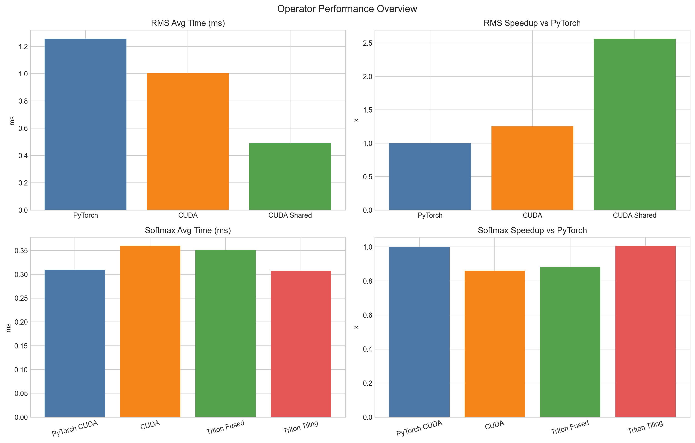
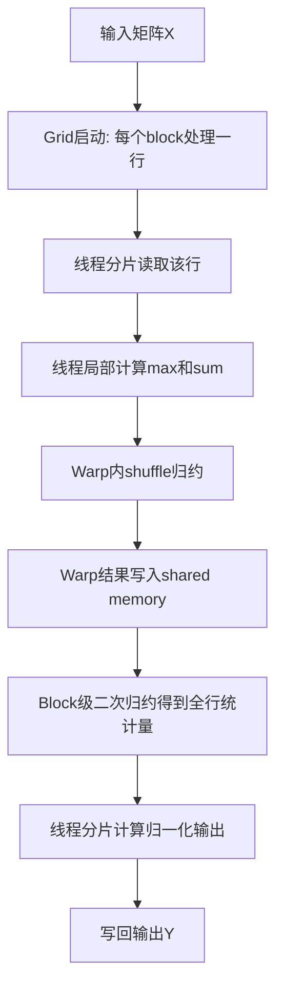

# RMS 与 Softmax 算子优化实践汇报

## 1. 结果先行

本次报告先给出可复现实验结果，再解释实现方法与优化路径。当前指标统一为：

- 平均耗时（ms）
- 最大误差（相对 PyTorch）
- 加速比（vs PyTorch）
- 吞吐量（GElements/s）

### 1.1 RMS 结果（shape = `(4, 512, 4096)`）

| 实现 | 平均耗时(ms) | 最大误差 | 加速比(vs PyTorch) | 吞吐量(GEl/s) |
|---|---:|---:|---:|---:|
| PyTorch | 1.2574 | 0.00e+00 | 1.00 | 6.67 |
| CUDA | 1.0044 | 1.24e-05 | 1.25 | 8.35 |
| CUDA Shared | 0.4902 | 1.91e-06 | 2.56 | 17.11 |

### 1.2 Softmax 结果（多 shape 平均）

测试 shape：`(4096,1024)`、`(2048,4096)`、`(1024,8192)`

| 实现 | 平均耗时(ms) | 最大误差 | 加速比(vs PyTorch) | 吞吐量(GEl/s) |
|---|---:|---:|---:|---:|
| PyTorch CUDA | 0.3097 | 0.00e+00 | 1.00 | 24.27 |
| CUDA | 0.3600 | 1.12e-08 | 0.86 | 19.56 |
| Triton Fused | 0.3510 | 1.12e-08 | 0.88 | 19.47 |
| Triton Tiling | 0.3076 | 7.45e-09 | 1.01 | 23.56 |

### 1.3 性能图（总览 + 分算子）

总览对比图：



RMS 详细图：


Softmax 详细图：


从结果看：

- RMS 的 `CUDA Shared` 明显优于基线，优化方向有效。
- Softmax 里 `Triton Tiling` 在当前测试区间略优于 PyTorch（1.01x），`Triton Fused` 接近 PyTorch，但在大列宽下仍有调参空间。

---

## 2. RMS 优化方法（先结论后方法）

核心代码：`build/rms_norm_kernel.cu`

RMS 这部分收益最明显，优化主线可以概括为：

> 向量化访存（`float4`） + shared memory 缓存 + block 内归约 + warp 级归约。

### 2.1 方法一：向量化访存（`float4`）

你在 `rms_norm_naive` 里直接使用 `float4` 批量加载与写回，避免标量循环的高指令开销。

```cpp
float4 x_vec = *reinterpret_cast<const float4*>(&x[idx * D + d]);
float4 w_vec = *reinterpret_cast<const float4*>(&w[d]);
*reinterpret_cast<float4*>(&y[idx * D + d]) = y_vec;
```

这一步的意义：

- 每次处理 4 个元素，降低 load/store 指令密度；
- 对 `D=4096` 这类大维度更友好；
- 为后续 shared 版本打下连续访存基础。

### 2.2 方法二：单 kernel 融合路径

RMSNorm 计算流程是：

1. 先算一行平方和；
2. 再算 `rms = rsqrt(sum_sq / D + eps)`；
3. 再做 `y = x * rms * w`。

你在同一 kernel 内完成，减少了中间结果写回与多次 launch 开销。

### 2.3 方法三：Shared Memory 缓存

`rms_norm_shared_fixed` 将 `x` 与 `w` 映射到 shared memory：

```cpp
float* x_shared = shared_mem;
float* w_shared = &shared_mem[D];
float* sum_sq_shared = &shared_mem[2 * D];
```

并按线程分片加载：

```cpp
for (int i = tid; i < D; i += block_size) {
    x_shared[i] = x[token_idx * D + i];
    w_shared[i] = w[i];
}
```

这样做解决的是“重复全局访存”问题，尤其是每个 token 内部反复访问的 `x` 与 `w`。

### 2.4 方法四：Block 归约 + 广播

归约部分先写局部和，再树形 reduction：

```cpp
sum_sq_shared[tid] = partial_sum;
for (int stride = block_size / 2; stride > 0; stride >>= 1) {
    if (tid < stride) {
        sum_sq_shared[tid] += sum_sq_shared[tid + stride];
    }
    __syncthreads();
}
```

得到 `rms` 后再广播给全体线程写回输出。这种写法在 `1 block = 1 token` 的映射下比较稳。

### 2.5 方法五：warp 级归约路径

你还实现了 `rms_norm_shared_optimized`，使用 `__shfl_down_sync` 做 warp 归约，再做跨 warp 汇总。虽然当前 benchmark 未主测该分支，但这是更高阶的可扩展方向。

---

## 3. Softmax 优化方法（先结论后方法）

核心代码：

- `softmax/softmax_kernel.cu`
- `softmax/fused_softmax.py`
- `softmax/tiling_softmax.py`
- `softmax/benchmark_softmax.py`

Softmax 主线可以概括为：

> 手写 CUDA（online softmax + 分层归约）与 Triton（fused / tiling）双路径并行推进，再通过统一基准做交叉验证。

### 3.1 手写 CUDA：online softmax（数值稳定）

你不是用朴素 `exp(x)/sum(exp(x))`，而是在循环中动态维护 `local_max` 和 `local_sum`：

```cpp
if (val > local_max) {
    local_sum = local_sum * expf(local_max - val) + 1.0f;
    local_max = val;
} else {
    local_sum += expf(val - local_max);
}
```

优势：

- 数值稳定；
- 把“找最大值 + 归一化分母”放在同一在线过程，减少额外 pass。

### 3.2 手写 CUDA：向量化 + 并行映射

`softmax_kernel.cu` 中使用 `float4`：

```cpp
const float4* x_vec_ptr = reinterpret_cast<const float4*>(x + row * D);
float4* y_vec_ptr = reinterpret_cast<float4*>(y + row * D);
```

并采用：

- `1 block = 1 row`
- `threads_per_block = 256`

这个映射和“按最后一维做 softmax”的数据布局天然匹配。

### 3.3 手写 CUDA：分层归约结构

归约路径是：线程局部 -> warp -> block。

关键片段：

```cpp
warp_reduce_online(local_max, local_sum);
if (lane == 0) {
    s_max[wid] = local_max;
    s_sum[wid] = local_sum;
}
```

这比纯 shared memory 归约更高效，原因是 warp 内可用 shuffle，减少同步和 shared 访问。

### 3.4 Triton Fused：算子融合路径

`fused_softmax.py` 中核心逻辑是在一个 kernel 内完成 load/max/exp/sum/store。

```python
x = tl.load(...)
x = x - tl.max(x, axis=0)
numerator = tl.exp(x)
denominator = tl.sum(numerator, axis=0)
tl.store(..., numerator / denominator)
```

这种方式减少中间数据写回，适合中等列宽场景。

### 3.5 Triton Tiling：长向量分块路径

`tiling_softmax.py` 采用两遍 tile 扫描：

- 第一遍累计全局 `running_max`、`running_sum`
- 第二遍写回归一化输出

```python
running_sum = running_sum * tl.exp(running_max - new_max) + tl.sum(tl.exp(x - new_max), axis=0)
```

这条路径对长列宽更稳，能避免单块资源压力过大。

### 3.6 参数搜索（autotune）融入统一流程

两条 Triton 路线都使用了 `@triton.autotune(..., key=["n_cols"])`，按列数选择配置，不再依赖单一手工参数。

```python
@triton.autotune(configs=[...], key=["n_cols"])
@triton.jit
def _tiling_softmax_kernel(...):
    ...
```

这里把 autotune 作为整体实现的一部分，不是单独功能，而是“让 fused/tiling 在不同 shape 下更稳定”的必要手段。

### 3.7 基准公平性控制（避免偶然结论）

`benchmark_softmax.py` 中引入输入池，避免重复使用同一输入导致缓存偏置：

```python
x_pool = [torch.randn(rows, cols, device="cuda", dtype=DTYPE) for _ in range(INPUT_POOL_SIZE)]
for i in range(iters):
    fn(x_pool[i % len(x_pool)])
```

这也是为什么你会看到“部分区间快、部分区间接近或略慢”的真实情况：不同 shape 下最优实现并不相同。

---

## 4. 并行映射与分层归约（流程图 + 表）

### 4.1 Softmax 并行流程图（已修复语法）



### 4.2 分层归约对照表

| 层级 | 做什么 | 代码落点 | 性能意义 |
|---|---|---|---|
| 线程层 | 局部 max/sum | `softmax_online_vectorized_kernel` 局部循环 | 充分利用寄存器，减少共享内存压力 |
| Warp 层 | warp 内归约 | `warp_reduce_online` + `__shfl_down_sync` | 降低同步成本 |
| Block 层 | 跨 warp 汇总 | `s_max/s_sum` shared memory 汇总 | 得到全行最终归约结果 |

---

## 5. AI 编译器图中，本项目实际涉及的方法


### 5.1 显式使用（代码中直接体现）

| 方法名 | 这个方法在干嘛（简述） | 代码证据 |
|---|---|---|
| 图算融合 | 把多个连续算子步骤放到一个 kernel 里执行，减少中间写回 | `fused_softmax.py` 中 load/max/exp/sum/store 在单 kernel 完成 |
| 并行切分 | 将数据切成可并行执行的块，让线程块同时工作 | Softmax: `1 block = 1 row`；RMS Shared: `1 block = 1 token` |
| kernel tiling | 把长向量按 tile 分段处理，降低单块资源压力 | `tiling_softmax.py` 按 `BLOCK_SIZE` 两遍扫描 |
| Schedule opt | 选择更合适的执行配置（如 block/warp/stage）提升速度 | Triton `@autotune(... key=["n_cols"])` |
| 向量组合 | 用向量指令一次处理多个元素，提升吞吐 | CUDA 代码使用 `float4` 向量化读写 |
| Tensor 表达 | 使用张量作为统一计算/存储抽象 | 全流程基于 `torch.Tensor` 与 Triton tensor |
| DSL 描述 | 用领域语言描述 kernel 计算逻辑 | Triton 中 `tl.load/tl.exp/tl.sum/tl.store` |

### 5.2 隐式使用（不手写但执行链路会经过）

| 方法名 | 这个方法在干嘛（简述） | 链路说明 |
|---|---|---|
| IR 生成 | 把前端计算表示转成编译中间表示 | PyTorch/Triton 编译阶段自动完成 |
| LLVM IR | 作为后端优化与代码生成的中间层 | Triton 编译链路经过 LLVM IR |
| 指令选择 | 把中间操作映射到目标硬件指令 | GPU 后端编译器自动完成 |
| 寄存器分配 | 决定变量放哪些寄存器，减少访存 | 后端优化阶段自动完成 |
| 指令调度 | 调整指令顺序减少流水线等待 | 后端优化阶段自动完成 |
| 代码布局 | 组织最终代码结构，改善执行与跳转 | 编译/链接阶段自动处理 |
| Backend/GPU | 将优化后代码下发到 GPU 执行 | 最终执行目标即 GPU |

---

## 6. 结论

- RMS 的优化路线（向量化 + shared + 归约）已经形成稳定收益；
- Softmax 形成了手写 CUDA 与 Triton 双路线，并在统一口径下完成验证；
- 当前结果说明：不同 shape 下不存在“唯一最优实现”，需要按场景选策略；
- 指标体系已去除低可信度带宽，改为高可复验吞吐量。
